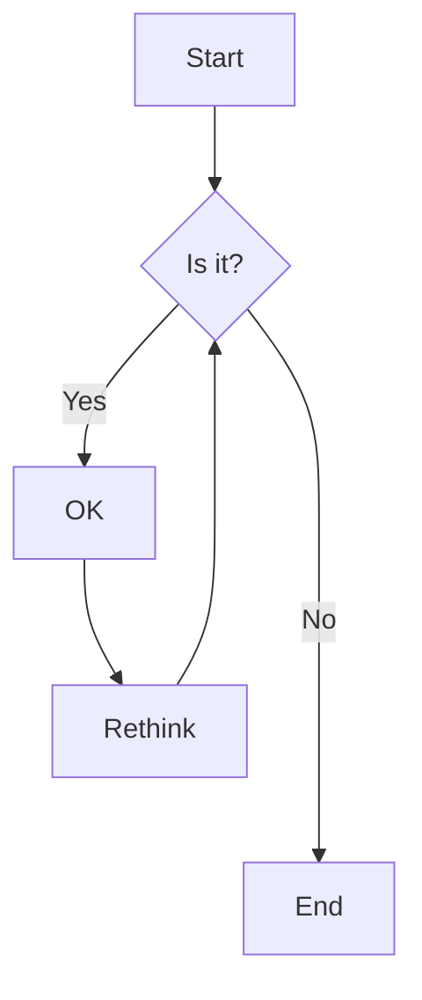
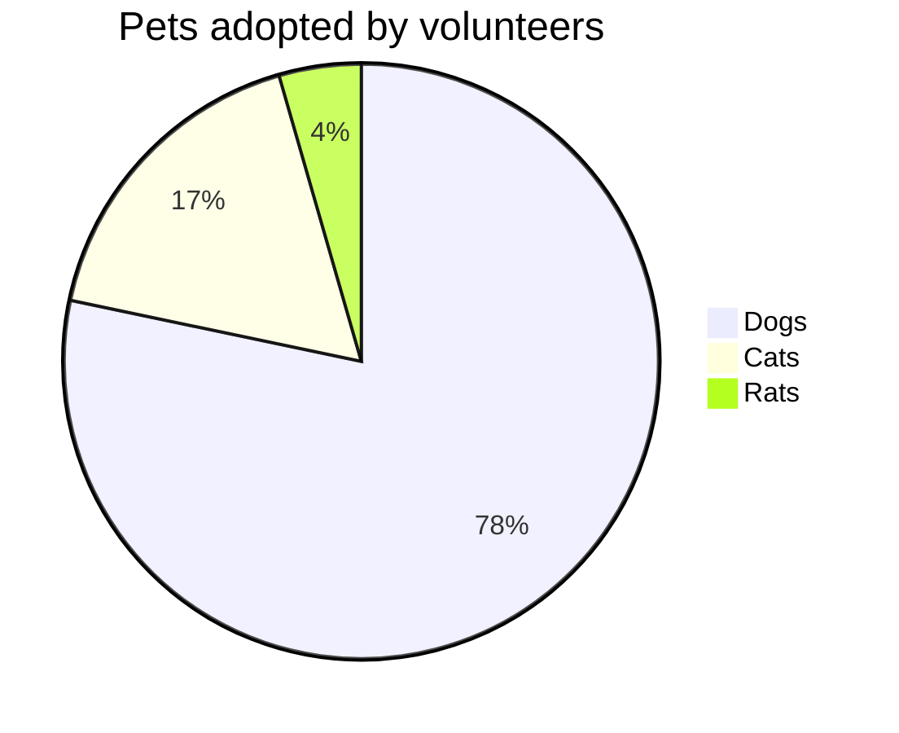
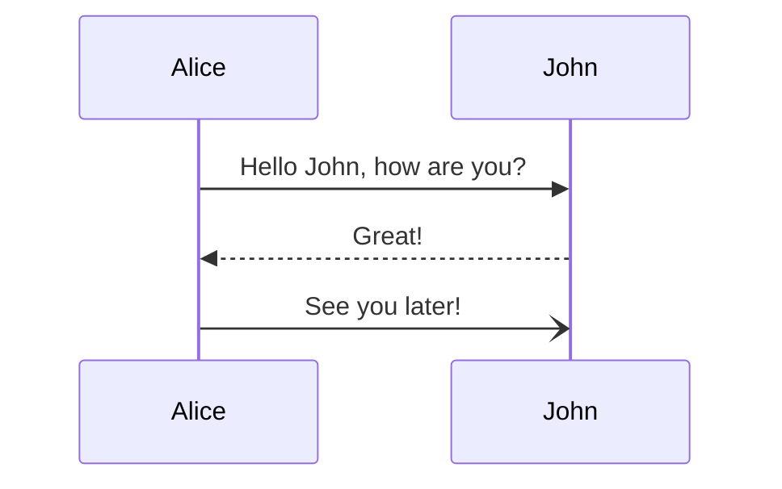
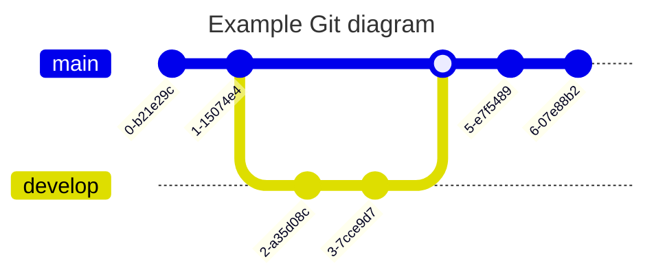
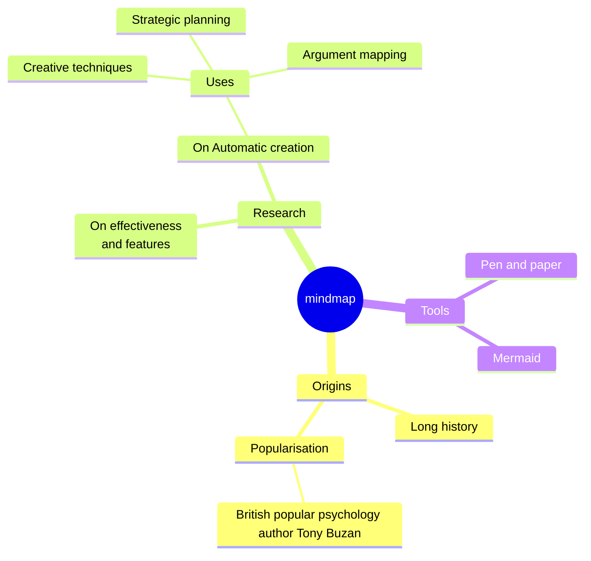

## Introduction

Technical documentation is not as simple as explaining a product, solution or process but also making sure that the end-user can understand it clearly. Written explanations are an essential component of well-written documentation but to improve the quality of the instructions, visual media will help to solidify those concepts. The problem is that being able to quickly create these diagrams is not something that a technical writer or software developer is normally able to do. But that can actually able accomplished using a open-source tool called [Mermaid](https://mermaid.js.org/) that allows you create diagrams using text and code.

Most of this article will be centered around the software developer experience but Mermaid is something that can be leveraged by individuals with non-technical backgrounds to improve their documentation.

## Why should you use Mermaid?

### Documentation and Communication

According to the StackOverflow 2023 Developer Survey, technical documentation was [the top online resource people use when learning to code](https://survey.stackoverflow.co/2023/#section-learning-to-code-online-resources-to-learn-how-to-code). It's critical to have well-written and thorough documentation. Clear and concise documentation helps in conveying complex technical concepts, system architecture, APIs, and usage instructions.

To encourage the adoption of a product or solution, it is crucial for developers to prioritize clear and accessible documentation. Failing to do so not only hampers the developer experience but also deters end-users and team members from utilizing the product. This holds true not only for technical documentation aimed at developers but also for explanatory content designed for those without technical background. By leveraging tools like Mermaid, developers can enhance the clarity and accessibility of their documentation.

### Diagrams for Visualizing Concepts

Mermaid provides a simple way to create diagrams, such as flowcharts and sequence diagrams, for explaining things like workflows, data structures, or algorithms. Now, you can visually represent these concepts into technical documentation, which can enhance the readability and comprehension of the written content, making it easier for end-users to grasp the product or solution.

### Version Control and Maintainability

Version Control tools like Git changed the game when it came to keeping track of changes of code and was made possible because of their plain text format. Although normally visual media is not something that can be kept under version control, Mermaid on the other hand works perfectly because it's just Markdown. Technical writers can manage diagram changes in a similar manner to code changes, allowing for easy tracking, collaboration, and maintenance of the documentation.

### Interactive and Responsive Diagrams

Mermaid also has interactive components built into them, allowing readers to zoom, pan or collapse specific parts of the diagrams. Interactivity can help with engaging those perusing the documentation, thus providing clarity to those referring the documentation.

## Syntax and Usage

It's all Markdown! If you've ever used Reddit, Github, StackExchange or [Obsidian](https://obsidian.md/)(which I absolutely love!), you may be familiar with Markdown already. Software developers and IT professionals are often [found using Markdown](https://survey.stackoverflow.co/2023/#section-most-popular-technologies-asynchronous-tools) to take notes, write documentation or organize thoughts and ideas.

To start using Mermaid, create a code block tagged as Mermaid file:

````markdown
```mermaid


```
````

From here you can begin designing your diagrams and charts.

## Diagrams and Charts Available

Mermaid has a somewhat extensive selection of diagrams and charts already available. I want to go through some of the diagrams and charts you should expect to see in a diagram tool but also some diagrams that are unique, niche and ready to use right out of the box. Please refer to the extensive Mermaid documentation for more details on how to create them.

### Flowchat



### Pie Chart



### Sequence Diagram



### Gitgraph Diagram



### Mind Maps



### Quadrant Chart


### What about X type of diagram?

If you're disappointed because a specific type of diagram is not supported, then you're still in luck! Mermaid is an open-source project which means that other developers can contribute and add support for a specific diagram that is important to their workflow. Consider a developer who is trying to have a stronger grasp on data structures and want to have support to be able to create [arrays, linked lists, queues, etc](https://github.com/mermaid-js/mermaid/issues/1277). Or maybe a team that wants to the ability to create a [roadmap](https://github.com/mermaid-js/mermaid/issues/1762) to visualize strategic alignments and planned initiatives.

## Where do you start?

Fortunately, the developers behind Mermaid do a great job with providing quality documentation on how to use it. The [Mermaid Live Editor](https://mermaid.live/) is a tool developed by the same developers that can easily give you ability to create these diagrams.

Technical writing is an integral part of software development, and Mermaid can be a valuable tool for enhancing the quality and effectiveness of technical documentation. By leveraging Mermaid to create visual diagrams and charts, technical writers can improve communication, simplify complex concepts, foster collaboration, and enhance the overall readability and comprehension of the written content.
